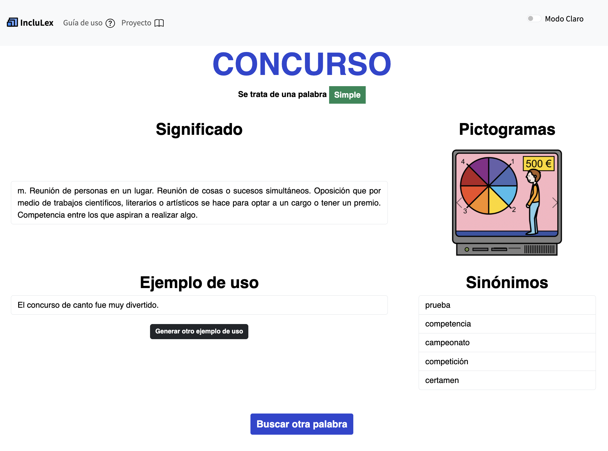

# IncluLex

IncluLex Hub is a web-based platform designed to improve information accessibility by simplifying complex text for users with cognitive disabilities, limited language proficiency, or low literacy levels. The platform integrates various linguistic resources to provide simplified definitions, synonyms, and pictograms using Natural Language Processing (NLP) techniques and lexical simplification models. It adheres to accessibility standards (WCAG 2.1) and promotes inclusion by offering a user-friendly interface. The platform is built with a React frontend and a Flask-based backend, ensuring scalability and efficient data handling.

## React Client Application Routes

- Route `/`: main page
- Route `/search/:word`: display all the related information of a word given it name
- Route `/guia-uso`: display all the related information about the usage of the platform
- Route `/proyecto`: display all the related information about the proyect created
- Route`*`: page not found route

## Database Files

- Table `frecuencia` - contains palabra frecuencia
- JSON `dictionary` - contains palabra definition
- JSON `sinant` - contains palabra sinónimos
- Text File `EjemplosSimplificacion`- contains input output simplification examples
- Text File `Instrucciones`- contains different instructions for the LLM to follow

## Main React Components

- `SearchBar` (in `SearchBar.jsx`): to render the search bar in which you are able to search teh desired term
- `WordMeaning` (in `WordMeaning.jsx`): to render all the word info of the given word
- `GuiaUso` (in `GuiaUso.jsx`): to explain all the info about the usage of the web page
- `Proyecto`(in `Proyecto.jsx`): to gather all the information regarding the proyect
- `NotFound` (in `NotFound.jsx`):  to render a default layout when no route is matched

(only _main_ components, minor ones may be skipped)

## Architecture

### Frontend

### Backend

## Web Overview

https://github.com/user-attachments/assets/27d37622-e695-4c63-9fc6-d6b7b68097ea

## Quickstart

`cd backend`; `python3 startup.py`;
`cd frontend`; `npm run dev`;
